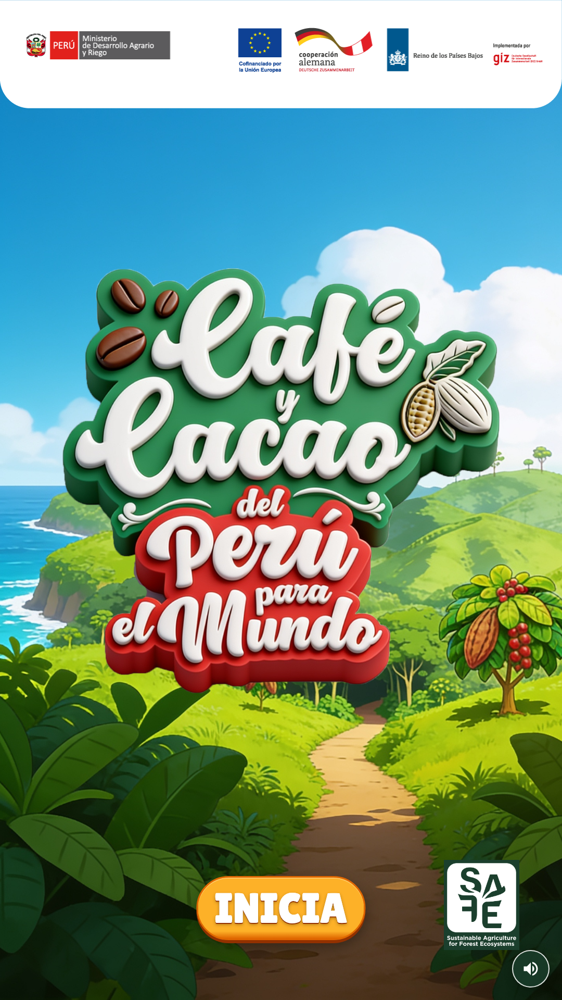

# Café y Cacao del Perú para el Mundo

Experiencia interactiva tipo **kiosk** sobre la cadena de valor del **café y cacao peruano**. Diseñada para pantallas verticales (1080×1920), guía al visitante por un recorrido educativo con mapa, fichas informativas y un quiz final.



---

## De qué trata el proyecto

Aplicación web estática (sin servidor en el kiosk) desarrollada con **Astro** y **TypeScript**. El jugador explora **12 puntos** del mapa de Perú — cada uno con texto e imagen sobre producción, comercio o sostenibilidad — y luego responde **8 preguntas** de opción múltiple. Al terminar, puede registrarse en un formulario para guardar su puntaje y tiempo.

El proyecto incluye:

- **Frontend** (`src/` → `dist/`): juego completo, listo para desplegar en cualquier hosting estático.
- **Backend opcional** (`infrastructure/`): API en AWS (Lambda + DynamoDB + SES) para persistir resultados y enviar notificaciones por correo.

Sin la infraestructura AWS el juego funciona con normalidad; solo falla el guardado remoto del formulario final.

### Flujo del juego

```text
Inicio → Mapa (12 puntos en orden) → Quiz (8 preguntas) → Gracias (formulario + resultado) → Volver a jugar
```

| Pantalla | Qué hace |
|----------|----------|
| **Inicio** | Logos institucionales, título del proyecto, botón INICIA y música de fondo |
| **Mapa** | 12 puntos interactivos sobre el camino; se desbloquean en secuencia |
| **Detalle** | Ficha con imagen y texto al tocar un punto del mapa |
| **Quiz** | 8 preguntas con opciones barajadas y cronómetro ascendente |
| **Gracias** | Puntaje, tiempo, formulario de registro y botón para reiniciar |

---

## Estructura del proyecto

```text
cacao-coffee-interactive/
├── docs/
│   └── images/
│       └── home-screenshot.png   ← Captura de la pantalla de inicio
├── public/                       ← Assets estáticos (origen en desarrollo)
│   ├── images/                   ← Fondos, mapa, logos, fotos 01.jpg–12.jpg
│   └── audio/                    ← Música de fondo
├── src/
│   ├── pages/
│   │   └── index.astro           ← Página única del juego
│   ├── components/               ← Pantallas: inicio, mapa, quiz, gracias, overlay
│   ├── scripts/
│   │   └── game.ts               ← Lógica del flujo y estado del juego
│   ├── data/
│   │   ├── mapPoints.ts          ← 12 puntos del mapa (posición, texto, imagen)
│   │   └── questions.ts          ← 8 preguntas del quiz
│   ├── lib/
│   │   ├── api.ts                ← Envío de puntajes a la API (opcional)
│   │   ├── preload.ts            ← Precarga de imágenes
│   │   └── gameAssets.ts         ← Rutas de assets usados en el juego
│   ├── layouts/
│   │   └── Layout.astro          ← HTML base y meta
│   └── styles/
│       └── game.css              ← Estilos del kiosk
├── dist/                         ← Sitio publicado (generado con npm run build)
├── infrastructure/               ← Backend AWS opcional (CDK: Lambda, DynamoDB, SES)
├── package.json
├── astro.config.mjs
└── README.md
```

---

## Dos partes del proyecto

| Parte | Carpeta | ¿Obligatoria? | Qué hace |
|-------|---------|---------------|----------|
| **Juego (frontend)** | `dist/` | Sí, para el kiosk | HTML, CSS, JS, imágenes, audio |
| **API de puntajes (backend)** | `infrastructure/` | No | Guarda puntajes en DynamoDB y envía correos (Lambda + SES) |

El juego **funciona sin la infraestructura**. La infra **solo hace falta** si quieres que el formulario **Enviar** guarde resultados en AWS.

---

## ¿Dónde está lo “público”?

| Carpeta | Cuándo | Contenido |
|---------|--------|-----------|
| **`public/`** | Desarrollo (`npm run dev`) | Imágenes, audio, favicon. Se sirven desde `/images/...`, `/audio/...`. |
| **`dist/`** | Producción / kiosk | Resultado de `npm run build`. **Esta carpeta es la que se despliega.** |

Si cambias un archivo en `public/`, en desarrollo se ve al recargar.  
En producción hay que volver a ejecutar `npm run build` para actualizar `dist/`.

### Assets principales (`public/`)

| Ruta | Uso |
|------|-----|
| `public/images/` | Fondos, mapa, logos, fotos de puntos (`01.jpg`–`12.jpg`) |
| `public/audio/cancion-eudr-pista.mp3` | Música de fondo |
| `public/favicon.svg` | Icono del sitio |

Tras el build, los mismos archivos quedan en `dist/images/`, `dist/audio/`, etc.

---

## Requisitos

- **Node.js** ≥ 22.12.0
- **npm**

Para la infraestructura AWS (opcional):

- **AWS CLI** con perfil `cacao` configurado
- **AWS CDK** (vía `npx cdk` dentro de `infrastructure/`)
- Correo verificado en **Amazon SES** (misma región del deploy)

---

## 1. Desarrollo local

```bash
cd cacao-coffee-interactive
npm install
npm run dev
```

Abrir: **http://localhost:4321**

---

## 2. Generar la versión publicada

```bash
npm run build
```

Genera / actualiza **`dist/`**.

Vista previa del build:

```bash
npm run preview
```

---

## 3. Desplegar el juego (kiosk o servidor)

Sube **todo el contenido de `dist/`** al hosting estático. No hace falta Node en el servidor.

Probar localmente la carpeta publicada:

```bash
npx serve dist
# o
cd dist && python3 -m http.server 8080
```

Recomendado en kiosk: navegador en pantalla completa (probado en 1080×1920 vertical).

---

## 4. Infraestructura AWS (opcional — API de puntajes)

La carpeta **`infrastructure/`** despliega con **AWS CDK**:

- Tabla **DynamoDB** (`CacaoData`)
- **Lambda** con URL pública (POST/GET puntajes)
- **SES** para notificaciones por correo

**No despliega el juego.** El frontend sigue en `dist/` por separado.

### 4.1 Variables de entorno

En la **raíz del proyecto**, crea `.env`:

```env
SENDER_EMAIL=tu-correo-verificado@dominio.com
PUBLIC_SCORES_API_URL=
```

| Variable | Uso |
|----------|-----|
| `SENDER_EMAIL` | Lo lee CDK al desplegar la Lambda |
| `PUBLIC_SCORES_API_URL` | URL de la Lambda; la completas **después** del deploy y antes del `npm run build` |

### 4.2 Verificar perfil AWS

```bash
aws sts get-caller-identity --profile cacao
```

Debe devolver la cuenta y el usuario/rol correctos.

### 4.3 Instalar dependencias de infra

```bash
cd infrastructure
npm install
```

### 4.4 Bootstrap (solo la primera vez por cuenta/región)

```bash
cdk bootstrap --profile cacao
```

### 4.5 Deploy

```bash
cdk deploy --profile cacao
```

Al terminar, copia el output **`FunctionUrl`**.

### 4.6 Conectar el frontend

En el `.env` de la raíz del proyecto:

```env
PUBLIC_SCORES_API_URL=https://xxxxxxxx.lambda-url.REGION.on.aws/
```

Regenera el build (Astro embebe esta variable al compilar):

```bash
cd ..
npm run build
```

Vuelve a subir **`dist/`** al kiosk o servidor.

### Comandos útiles (infra)

```bash
cd infrastructure

cdk diff --profile cacao      # ver cambios antes de desplegar
cdk synth --profile cacao     # generar CloudFormation
cdk destroy --profile cacao   # eliminar recursos (DynamoDB se conserva: RETAIN)
```

---

## Comandos rápidos (frontend)

| Comando | Acción |
|---------|--------|
| `npm run dev` | Servidor de desarrollo |
| `npm run build` | Genera `dist/` |
| `npm run preview` | Previsualiza `dist/` |

---

## Notas

- Sin `PUBLIC_SCORES_API_URL`, el juego funciona pero el guardado de puntajes fallará (aviso en consola del navegador).
- No subas `.env` a repositorios públicos.
